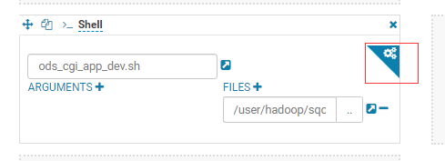
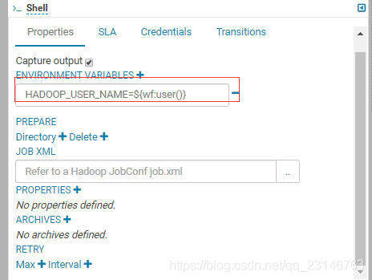

# 背景

通过hue进行管理的oozie任务，提交在运行时会抛出没有权限的错误。例子中使用了test的用户，但是查看其报错日志需要cloudera-scm的用户权限(这里环境使用了CDH，且开启单用户模式)。也就是说通过test用户提交的spark会在/user/cloudera-scm/.sparkStaging/application_1600403313664_3952374 建立一个临时的目录用于跑对应的spark任务，此时会报权限问题。

# 原因

hue job默认的运行用户是yarn（如果单用户模式的话就会是cloudera-scm），所以会在/user/yarn/.staging存储job运行时临时文件，由于开启了HDFS权限校验，每次会将/user/yarn/.staging权限重置为700，所以手动改权限也没用。

# 解决办法

在其workflow中添加环境变量 HADOOP_USER_NAME=${wf:user()}

