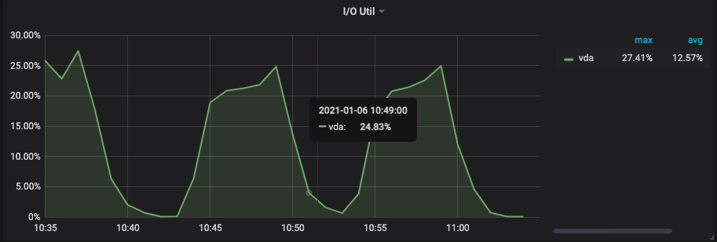

## 背景说明

本次使用esrally来进行ES的单实例压测，目的是对比在同等配置下，不同型号的CPU(AMD系列和Intel系列)的机型下，ES所能跑出的性能比较。


## 环境准备

- 1、安装esrally
- 2、安装单实例ES


## 机器信息

- 10.111.212.250 （AMD机型）
- 10.111.212.252 （Intel机型）

通过在AMD机器上跑esrally测试Intel，通过Intel机器跑esrally测试AMD，这种交叉测试的方式避免压测客户端本身的性能损耗。

## 机器配置


| 规格            | vcpu    | 内存   | 处理器主频      | 内网带宽     | 内网收发包 | 价格参考    | 处理器型号                               |
| --------------- | :------ | ------ | --------------- | ------------ | ---------- | ----------- | ---------------------------------------- |
| ecs.g6a.4xlarge | 16 vCPU | 64 GiB | 2.6 GHz/3.3 GHz | 最高 10 Gbps | 200 万 PPS | ￥ 3.52 /时 | AMD EPYC™ ROME 7H12                      |
| ecs.g6.4xlarge  | 16 vCPU | 64 GiB | 2.5 GHz/3.2 GHz | 最高 10 Gbps | 100 万 PPS | ￥ 4.0 /时  | Intel Xeon(Cascade Lake) Platinum 8269CY |


## 测试命令


```shell
# 测试AMD的机型
esrally --pipeline=benchmark-only --track-path=/data/tracks/myou2 --target-hosts=10.111.212.250:9200  --report-file=/tmp/report_http_logs.md

# 测试Intel的机型
esrally --pipeline=benchmark-only --track-path=/data/tracks/myou2 --target-hosts=10.111.212.252:9200  --report-file=/tmp/report_http_logs.md

# 测试的bulk
设置为15000

# 测试的client数
设置为16
```

## 测试结果

#### Intel机型

##### cpu使用率图

 


##### 磁盘使用率



##### 带宽使用率


基本可以确定瓶颈在CPU上，此时的测试结果如下：

```shell

    ____        ____
   / __ \____ _/ / /_  __
  / /_/ / __ `/ / / / / /
 / _, _/ /_/ / / / /_/ /
/_/ |_|\__,_/_/_/\__, /
                /____/

[INFO] Racing on track [myou2] and car ['external'] with version [7.6.1].

Running delete-index                                                           [100% done]
Running create-index                                                           [100% done]
Running cluster-health                                                         [100% done]
Running bulk                                                                   [100% done]

------------------------------------------------------
    _______             __   _____
   / ____(_)___  ____ _/ /  / ___/_________  ________
  / /_  / / __ \/ __ `/ /   \__ \/ ___/ __ \/ ___/ _ \
 / __/ / / / / / /_/ / /   ___/ / /__/ /_/ / /  /  __/
/_/   /_/_/ /_/\__,_/_/   /____/\___/\____/_/   \___/
------------------------------------------------------

|                                                         Metric |   Task |     Value |   Unit |
|---------------------------------------------------------------:|-------:|----------:|-------:|
|                     Cumulative indexing time of primary shards |        |   77.3612 |    min |
|             Min cumulative indexing time across primary shards |        |   77.3612 |    min |
|          Median cumulative indexing time across primary shards |        |   77.3612 |    min |
|             Max cumulative indexing time across primary shards |        |   77.3612 |    min |
|            Cumulative indexing throttle time of primary shards |        |         0 |    min |
|    Min cumulative indexing throttle time across primary shards |        |         0 |    min |
| Median cumulative indexing throttle time across primary shards |        |         0 |    min |
|    Max cumulative indexing throttle time across primary shards |        |         0 |    min |
|                        Cumulative merge time of primary shards |        |   11.3626 |    min |
|                       Cumulative merge count of primary shards |        |        76 |        |
|                Min cumulative merge time across primary shards |        |   11.3626 |    min |
|             Median cumulative merge time across primary shards |        |   11.3626 |    min |
|                Max cumulative merge time across primary shards |        |   11.3626 |    min |
|               Cumulative merge throttle time of primary shards |        |   1.41883 |    min |
|       Min cumulative merge throttle time across primary shards |        |   1.41883 |    min |
|    Median cumulative merge throttle time across primary shards |        |   1.41883 |    min |
|       Max cumulative merge throttle time across primary shards |        |   1.41883 |    min |
|                      Cumulative refresh time of primary shards |        |  0.213117 |    min |
|                     Cumulative refresh count of primary shards |        |        29 |        |
|              Min cumulative refresh time across primary shards |        |  0.213117 |    min |
|           Median cumulative refresh time across primary shards |        |  0.213117 |    min |
|              Max cumulative refresh time across primary shards |        |  0.213117 |    min |
|                        Cumulative flush time of primary shards |        |   1.97807 |    min |
|                       Cumulative flush count of primary shards |        |        22 |        |
|                Min cumulative flush time across primary shards |        |   1.97807 |    min |
|             Median cumulative flush time across primary shards |        |   1.97807 |    min |
|                Max cumulative flush time across primary shards |        |   1.97807 |    min |
|                                        Total Young Gen GC time |        |     1.313 |      s |
|                                       Total Young Gen GC count |        |        40 |        |
|                                          Total Old Gen GC time |        |         0 |      s |
|                                         Total Old Gen GC count |        |         0 |        |
|                                                     Store size |        |   12.7656 |     GB |
|                                                  Translog size |        |   1.37901 |     GB |
|                                         Heap used for segments |        |   12.8625 |     MB |
|                                       Heap used for doc values |        |  0.598782 |     MB |
|                                            Heap used for terms |        |   10.9866 |     MB |
|                                            Heap used for norms |        | 0.0718994 |     MB |
|                                           Heap used for points |        |         0 |     MB |
|                                    Heap used for stored fields |        |   1.20521 |     MB |
|                                                  Segment count |        |       123 |        |
|                                                 Min Throughput |   bulk |   7604.56 | docs/s |
|                                              Median Throughput |   bulk |   83556.4 | docs/s |
|                                                 Max Throughput |   bulk |   98877.6 | docs/s |
|                                        50th percentile latency |   bulk |   3991.72 |     ms |
|                                        90th percentile latency |   bulk |   4673.28 |     ms |
|                                        99th percentile latency |   bulk |   5158.38 |     ms |
|                                      99.9th percentile latency |   bulk |    5345.8 |     ms |
|                                       100th percentile latency |   bulk |   5441.82 |     ms |
|                                   50th percentile service time |   bulk |   3991.72 |     ms |
|                                   90th percentile service time |   bulk |   4673.28 |     ms |
|                                   99th percentile service time |   bulk |   5158.38 |     ms |
|                                 99.9th percentile service time |   bulk |    5345.8 |     ms |
|                                  100th percentile service time |   bulk |   5441.82 |     ms |
|                                                     error rate |   bulk |         0 |      % |


---------------------------------
[INFO] SUCCESS (took 349 seconds)
---------------------------------
```

这里重点关注吞吐量和延迟：

|  Min Throughput |   bulk |   7604.56 | docs/s |
|  Median Throughput |   bulk |   83556.4 | docs/s |
|  Max Throughput |   bulk |   98877.6 | docs/s 

平均吞吐量在8.3w，延迟在 5.3s

#### AMD机型

##### cpu使用率图


##### 磁盘使用率


##### 网络使用率


基本可以确定瓶颈在CPU上，此时的测试结果如下：

```shell
INFO] Racing on track [myou2] and car ['external'] with version [7.6.1].

Running delete-index                                                           [100% done]
Running create-index                                                           [100% done]
Running cluster-health                                                         [100% done]
Running bulk                                                                   [100% done]

------------------------------------------------------
    _______             __   _____
   / ____(_)___  ____ _/ /  / ___/_________  ________
  / /_  / / __ \/ __ `/ /   \__ \/ ___/ __ \/ ___/ _ \
 / __/ / / / / / /_/ / /   ___/ / /__/ /_/ / /  /  __/
/_/   /_/_/ /_/\__,_/_/   /____/\___/\____/_/   \___/
------------------------------------------------------

|                                                         Metric |   Task |     Value |   Unit |
|---------------------------------------------------------------:|-------:|----------:|-------:|
|                     Cumulative indexing time of primary shards |        |   72.1025 |    min |
|             Min cumulative indexing time across primary shards |        |   72.1025 |    min |
|          Median cumulative indexing time across primary shards |        |   72.1025 |    min |
|             Max cumulative indexing time across primary shards |        |   72.1025 |    min |
|            Cumulative indexing throttle time of primary shards |        |         0 |    min |
|    Min cumulative indexing throttle time across primary shards |        |         0 |    min |
| Median cumulative indexing throttle time across primary shards |        |         0 |    min |
|    Max cumulative indexing throttle time across primary shards |        |         0 |    min |
|                        Cumulative merge time of primary shards |        |   10.0308 |    min |
|                       Cumulative merge count of primary shards |        |        78 |        |
|                Min cumulative merge time across primary shards |        |   10.0308 |    min |
|             Median cumulative merge time across primary shards |        |   10.0308 |    min |
|                Max cumulative merge time across primary shards |        |   10.0308 |    min |
|               Cumulative merge throttle time of primary shards |        |   1.76628 |    min |
|       Min cumulative merge throttle time across primary shards |        |   1.76628 |    min |
|    Median cumulative merge throttle time across primary shards |        |   1.76628 |    min |
|       Max cumulative merge throttle time across primary shards |        |   1.76628 |    min |
|                      Cumulative refresh time of primary shards |        |  0.192483 |    min |
|                     Cumulative refresh count of primary shards |        |        29 |        |
|              Min cumulative refresh time across primary shards |        |  0.192483 |    min |
|           Median cumulative refresh time across primary shards |        |  0.192483 |    min |
|              Max cumulative refresh time across primary shards |        |  0.192483 |    min |
|                        Cumulative flush time of primary shards |        |    1.8207 |    min |
|                       Cumulative flush count of primary shards |        |        23 |        |
|                Min cumulative flush time across primary shards |        |    1.8207 |    min |
|             Median cumulative flush time across primary shards |        |    1.8207 |    min |
|                Max cumulative flush time across primary shards |        |    1.8207 |    min |
|                                        Total Young Gen GC time |        |     1.764 |      s |
|                                       Total Young Gen GC count |        |        41 |        |
|                                          Total Old Gen GC time |        |         0 |      s |
|                                         Total Old Gen GC count |        |         0 |        |
|                                                     Store size |        |   13.6035 |     GB |
|                                                  Translog size |        |   1.17878 |     GB |
|                                         Heap used for segments |        |   14.8627 |     MB |
|                                       Heap used for doc values |        |  0.539261 |     MB |
|                                            Heap used for terms |        |   12.8561 |     MB |
|                                            Heap used for norms |        | 0.0667725 |     MB |
|                                           Heap used for points |        |         0 |     MB |
|                                    Heap used for stored fields |        |   1.40054 |     MB |
|                                                  Segment count |        |       116 |        |
|                                                 Min Throughput |   bulk |   8142.37 | docs/s |
|                                              Median Throughput |   bulk |   93803.6 | docs/s |
|                                                 Max Throughput |   bulk |    117955 | docs/s |
|                                        50th percentile latency |   bulk |   2576.99 |     ms |
|                                        90th percentile latency |   bulk |    3176.2 |     ms |
|                                        99th percentile latency |   bulk |    3827.8 |     ms |
|                                      99.9th percentile latency |   bulk |   4178.78 |     ms |
|                                       100th percentile latency |   bulk |   4616.34 |     ms |
|                                   50th percentile service time |   bulk |   2576.99 |     ms |
|                                   90th percentile service time |   bulk |    3176.2 |     ms |
|                                   99th percentile service time |   bulk |    3827.8 |     ms |
|                                 99.9th percentile service time |   bulk |   4178.78 |     ms |
|                                  100th percentile service time |   bulk |   4616.34 |     ms |
|                                                     error rate |   bulk |         0 |      % |


---------------------------------
[INFO] SUCCESS (took 316 seconds)
---------------------------------
```

这里重点关注吞吐量和延迟：

| Min Throughput |   bulk |   8142.37 | docs/s |
| Median Throughput |   bulk |   93803.6 | docs/s |
| Max Throughput |   bulk |    117955 | docs/s

平均吞吐量在9.3w，延迟在 4.1s

### 结果总结

从上面的结果来看，同等配置的情况下，AMD机型的结果集为：平均吞吐量在9.3w，延迟在 4.1s。 而 Intel机型的结果集为：平均吞吐量在8.3w，延迟在 5.3s。显然AMD机型压测出来的性能要比Intel机型压测出来的性能更加。