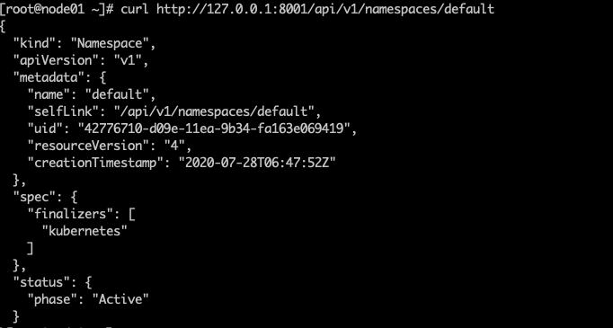

## 外部client连接API server时需要经过什么样的流程呢？

一般来说，clent接入API server需要进行3个步骤：

1、认证，用于身份校验。

2、授权，决定了你能在集群中做什么

3、准入控制，在授权后进行的一些额外的控制（非必选）

### 认证方式

k8s的认证方式是通过插件式设计的，可以自由配置符合自己的希望的认证方式。常见的认证方式有 token、ssl证。

- token 预共享秘钥

- ssl认证  双方均有证书，需要进行双方的证书认证

##  授权方式

RBAC

## k8s的资源定义

k8s是通过request path来对资源进行定义的。譬如

```html
curl https://ip:6443/apis/apps/v1/namespaces/default/deployment/nignx-deploy

这个用于获取default namespace下的名字为nignx-deploy的deployment
```

实验，正常通过上面的url是比较难测试的，因为是https接口，需要提供证书，可以通过在起一个proxy来代理，实现我们的目的。

```shell
[root@node01 ~]# kubectl proxy
Starting to serve on 127.0.0.1:8001
[root@node01 ~]# http://127.0.0.1:8001/api/v1/namespaces/default
```

